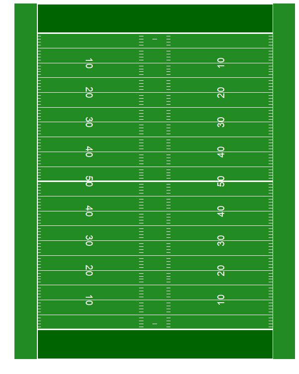
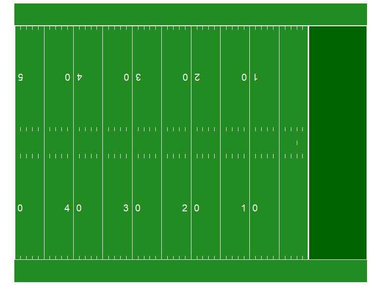
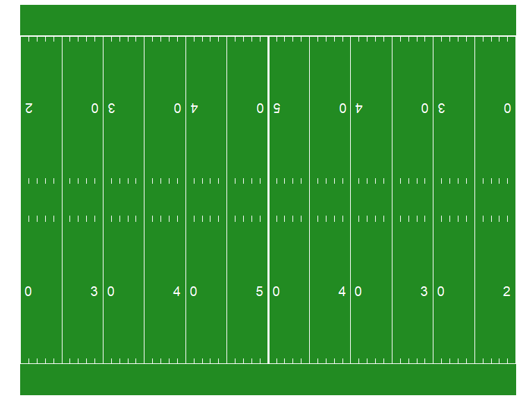
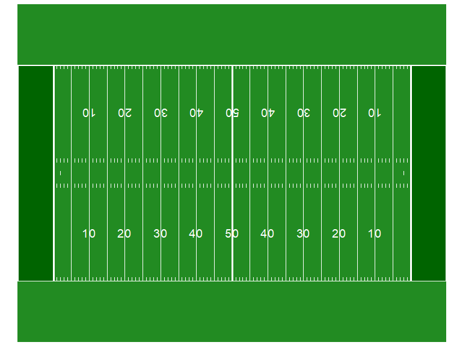
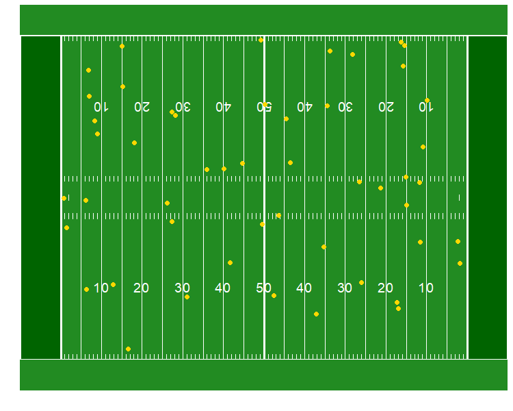
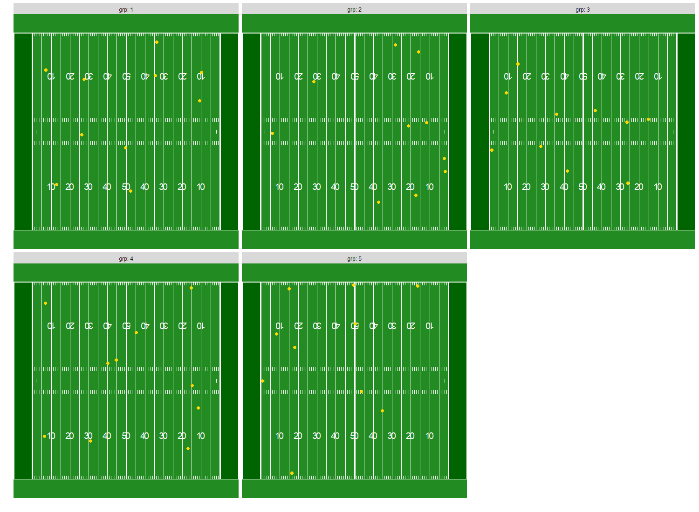
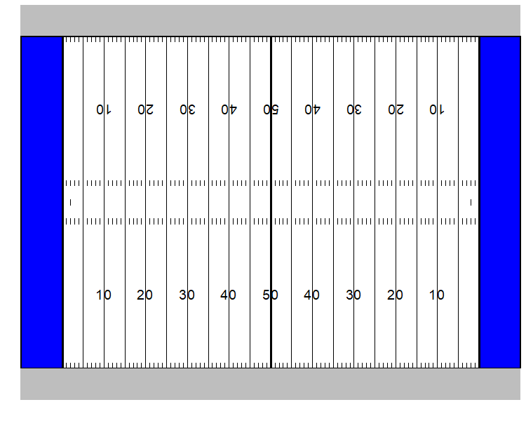
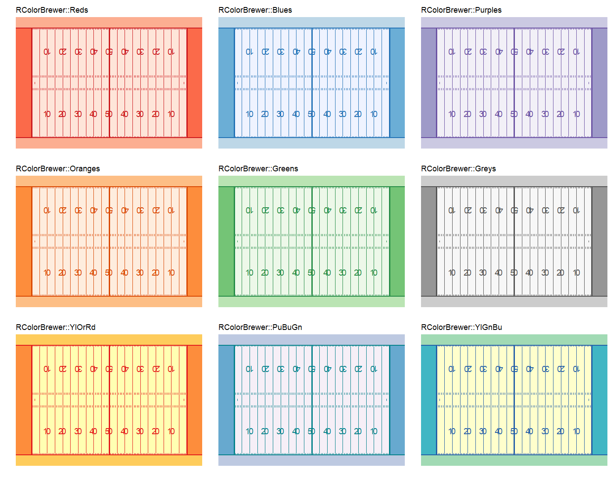

## Introduction

Welcome to `gg_field`!

Inspired by Matt Austin's [gg-rink](https://github.com/mtthwastn/statswithmatt/tree/master/hockey-with-r), `gg_field()` is a tidy way to incorporate an NFL field into your data viz workflow.

The `gg_field()` function creates a list of `ggplot2` annotations, and it can be added to a `ggplot()` call with a `+` before adding other geom layers. 

## Field Details

The units for this field are in yards. The origin starts at the bottom left of the field, with the x-axis going from 0 (back of left endzone) to 120 (back of right endzone), and the y-axis ranging from 0 (bottom sideline) to 53.33 (top sideline). Other key markers are the left goal line (x=10), 50-yard line (x=60), right goal line (x=110).

Current features: 
  - hash marks every yard, in the middle of the field and along each sideline
  - long yard marks every 5 yards
  - field numbers every 10 yards
  - conversion lines at each 2-yard line

## Basic gg_field


```{r}
source("gg_field.R")
ggplot() + gg_field()
```


## Vertical Field

```{r }
ggplot() + gg_field(direction="vert")
```



## Zooming in on the field

```{r pressure, echo=FALSE}
## right half of field, from 50 yard line to right end zone
ggplot() + gg_field(yardmin=60)
```


```{r pressure, echo=FALSE}
## middle of field, between the two 20-yard lines
ggplot() + gg_field(yardmin=30, yardmax=90)
```


## Sideline Buffer

Defaults to 5 yards on each sideline. Make it larger or smaller to get a different perspective on the field.

```{r pressure, echo=FALSE}
## larger sideline buffer
ggplot() + gg_field(buffer=15)
```




## Adding points to the field

```{r}
## generate random dataset with group labels
df <- data.frame(x=runif(50,10,110), y=runif(50, min=1, max=53), grp=rep(1:5,each=10))

ggplot(data=df, aes(x=x, y=y)) + 
  gg_field() +
  geom_point(col='gold', cex=2)
```


## Faceting

```{r}
ggplot(data=df, aes(x=x,y=y)) + 
  gg_field() + 
  geom_point(col='gold', cex=2) +
  facet_wrap(~grp, labeller = label_both)

```


## Changing color schemes

```{r}
## adjust all color arguments
ggplot() + 
  gg_field(field_color='white', line_color='black', 
           sideline_color = 'gray', endzone_color='blue') 
```



## Pretty Color Palettes

Think beyond the green field! Using color palettes from packages like `RColorBrewer`, you can create some beautiful field designs. (Code in `gg_field_examples.R`)



## Acknowledgements
 
Huge thank you to my 2020 Big Data Bowl teammates Asmae Toumi, Tony Elhabr, and Sydney Robinson for all their help with development, feedback, and testing!
